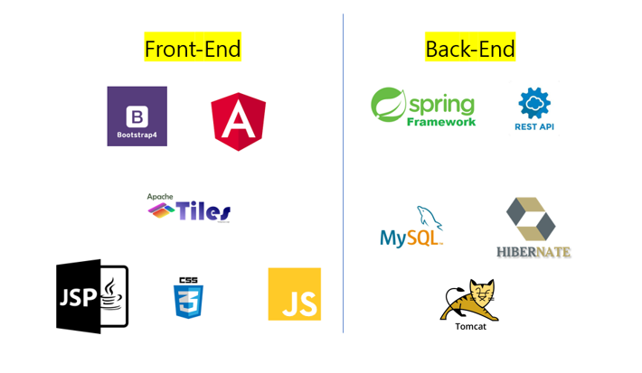

# eStore
Spring Framework - Web Server Project

- 작품 개요 

 Spring Framework 및 통합 가능한 Framework 를 이용한 웹 쇼핑몰.
  

- 개발 환경 및 타겟 플랫폼 

  - 타겟 플랫폼: Web 환경
  - 개발 도구: Eclipse Oxygen / MySQL Workbench

- Login Page 

- Products Page 

- Product View Page 

- Cart Page 

